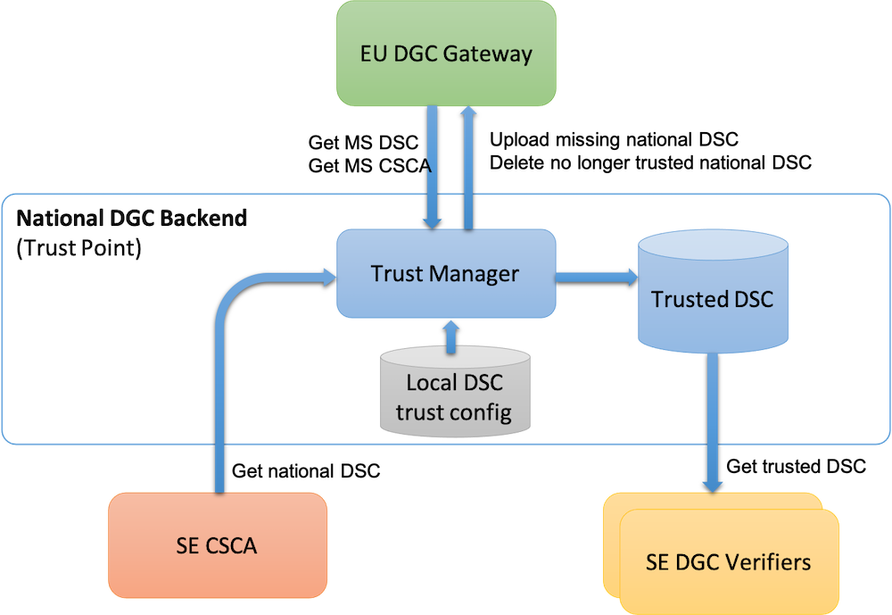
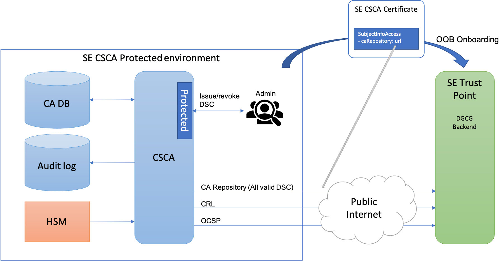
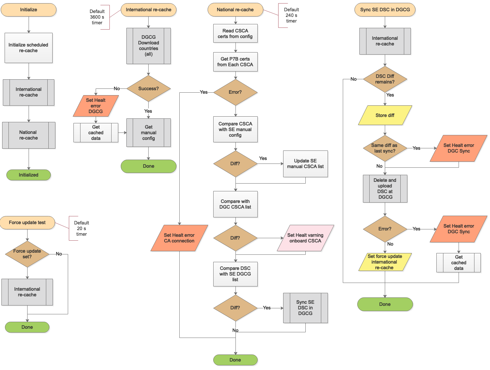

# Architecture of the Trust Point Service

## Scope

The Scope of the Trust Point service is to act as source of trusted document signer keys for national validation services in Sweden (SE).

The application provided in this project provides the functions of the "National DGC Backend" according to the following illustration:

## Trust model

The purpose of this infrastructure is to issue Digital Green Certificates (DGC) with proof of medical or vaccination status related to Covid-19. A DGC is issued by an authorized Document Signer. Each document signer issuing key is certified in a Document Signer Certificate (DSC). Each country operates one or more Certification Authorities (CA) issuing DSC. Such CA is called a national CSCA (Courntry Signing Certification Authority).

### Actors

The actors of this infrastructure are:

Actor | description
---|---
EU DGC Gateway  | The EU main key server holding information about national CSCA services and trusted document signer certificates (DSC). Each member state register their CSCA and DSC to the DGC Gateway and all member states can down load CSCA and DSC certificates from all other member states from the DGC Gateway.
National Backend Trust Point  | This service is responsible for uploading and downloading certificates to and from the EU DGC Gateway for a particular member state.
SE CSCA  | This is the Swedish CSCA service issuing DSC certificates to all swedish authorized DGC document signers.
SE DGC Verifiers  | Anyone who use this open infrastructure to validate the signature on a DGC. The trust information necessary to validate DGC are provided according to Swedish specifications adapted to the Swedish validation infrastructure, but this trust information is freely available.

## Trust data exchange

The role of the National DGC Backend is to keep an up to date list of valid document signers certificates (DSC) from all countries connected to the infrastructure. For this the DGC Backend has 3 different sources:

- Trusted DSC obtained from the national CSCA.
- Trusted DSC from the EU DGC Gateway.
- Additional trusted DSC based on local configuration.

The role of the Trust Point is further to ensure that the set of trused DSC from the Swedish CSCA is in sync with the EU DGC Gateway. When a certificate is issued by the Swedish CSCA to a Swedish document signer, its DSC is automatically uploaded to the EU DGC Gateway. The corresponding process is executed if a DSC is revoked or expired, where this automatically cause the Trust Point to delete this DSC from the EU DGC Gateway.

### National trust data from CSCA

The current list of Swedish DSC is continuously kept upt to date from the CSCA according to the following illustration:

The CSCA root certificate is installed in the Swedish Trust Point by Out-Of-Band manual procedures. This certificate holds the public key of the CSCA and a URL to the CSCA certificate repository. The Trust Point use the caRepository URL to continuously download the list of currently trusted DSC certificates from the CSCA. Each downloaded certificate is validated by the Trust Point against the public key of the CSCA and checked against revocation using the revocation services of the CSCA.

### Trust exchange process

The data synch process of the Trust Point is illustrated by the following flow diagrams:

**1) System initialization flow**

This flow is performed at startup or system reset where the international trusted data is downloaded first and then the national trusted data. The reason for this order is that the national trusted data is compared with the international data to detect differences that needs to be synchronized.

**2) International re-cache**

The international re-cache is a straightforward retrieval of:

 - Trusted CSCA certificates from all member states
 - All registered DSC from all member states

CSCA certificates are signed by the Gateway and all DSC are signed by the corresponding CSCA. These signatures are checked and revocation check is attempted if present. If evidence of revocation is encountered, then the DSC is blocked, otherwise it is trusted.

All successful downloads are cached and this cached data is used if the connection to the Gateway is lost.

**3) National re-cache**

The national re-cache is the most complex process as this process is responsible for keeping the list of national DSC and CSCA in sync with the DGC Gateway.

Once the trusted DSC are downloaded from the CSCA, this set, and the set of trusted CSCA is compared with the Swedish certificates onboarded and uploaded to the DGC Gateway. In case of deviations, the diff is fixed by necessary uploades and deletes.

A detection is also in place to detect if the same diff remains despite update attempts, indicating that the update process is malfunctioning. All errors are recorded and notified to system monitoring services, even if the service is kept running on cached data.

**4) Force update**

A force update can be triggered from an internal control port or from an internal event. Such force update is triggered any time there is an update made to the data in the DGC Gateway.

### Trust data export format:

Trusted data exported by this servie is formatted as a JSON Web Signature (JWS) according to the following specification: [https://github.com/DIGGSweden/dgc-trust/blob/main/specifications/trust-list.md](https://github.com/DIGGSweden/dgc-trust/blob/main/specifications/trust-list.md)

On the service home page 3 links are provided:

- A link to the trust data feed.
- A link to the certificate used to validate the signature on the feed.
- A link to the format specification of the data provided by the feed.
